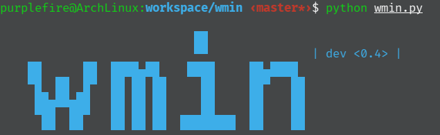
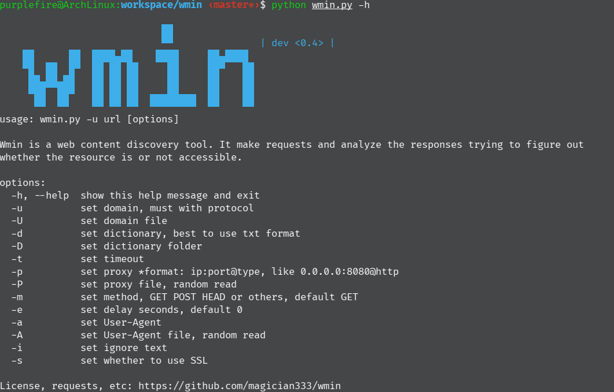
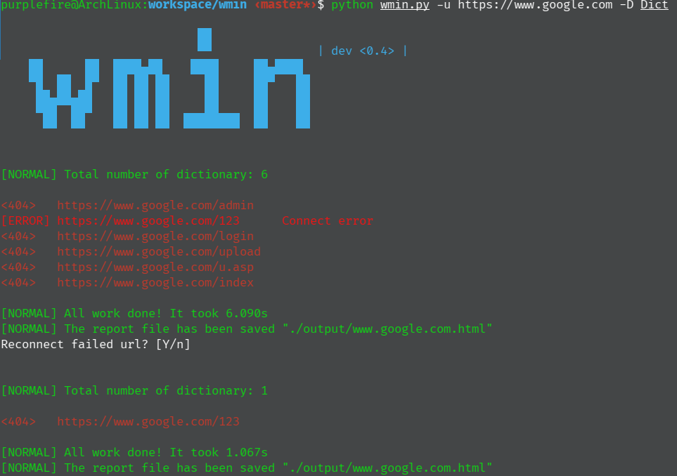
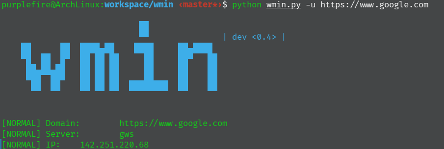

# **Wmin**

Wmin介绍
-------

Wmin(Website Miner)v0.4 是夜月魂信息技术团队-**紫火**开发的一款网站目录扫描器, 全平台支持，支持获取网站基础信息，隐蔽化慢速扫描，提供html扫描报告导出

该软件使用命令行参数，详细参数如下:
------
* -u(url) **target**    设置网址
* -U(url file) **target**    设置批量处理url
* -d(dictionary) **target**    设置字典
* -D(dictionary folder) **target**    设置多字典目录
* -t(timeout) **target**    设置超时(单位:秒)
* -p(proxy) **target**    设置IP代理(格式: ip:port@type)
* -P(Proxy file) **target**    设置IP代理文件路径
* -m(method) **target**    设置请求方式
* -e(delay) **target**    设置延迟(单位:秒)
* -a(User-Agent) **target**    设置UA
* -A(User-Agent file) **target**    设置UA文件
* -i(ignore_text)    **target**    设置忽略页面包含的文本
* -i(ssl)    **target**    设置SSL文件夹

界面展示
------
#### 帮助界面

***
#### 扫描界面

***
#### 侦查页面

***

特点
------
* 支持多url、多字典批量处理
* 支持自定义代理
* 支持自定义UA
* 支持忽略文本
* 支持多请求方式
* 支持随机UA，随机代理切换
* 支持网站基本信息获取
* 支持延时扫描
* 支持SSL
* 支持Linux、BSD、OS X、Windows等多平台

说明
------
* 扫描报告生成在output文件夹下，文件名为网站url
* 相同功能的大小写参数不能同时进行
* 批量处理文件要求每个url占一行，必须是文本文件
* 多字典要求指定一个字典目录,目录下必须放置文本字典文件
* 只输入网站url，将获取网站的IP地址和服务器类型
* 批量处理文件的编码必须是utf-8
* 扫描方式支持get、post、head等
* 使用SSL请指定CA文件位置

致谢
-----
* Project

    - [Requests](https://requests.readthedocs.io/en/master/)

    - [Colorama](https://github.com/tartley/colorama)
* Developer
    - 10087

其他
-----
* Wmin已经不支持Python2.x

* Wmin第三方依赖库：requests、colorama (程序内部已集成)
